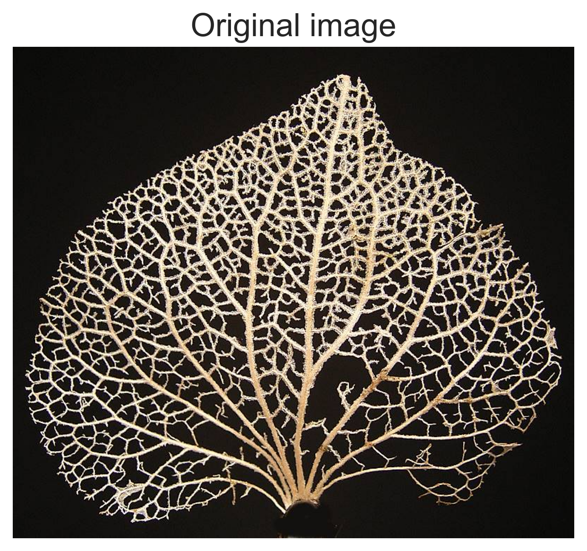
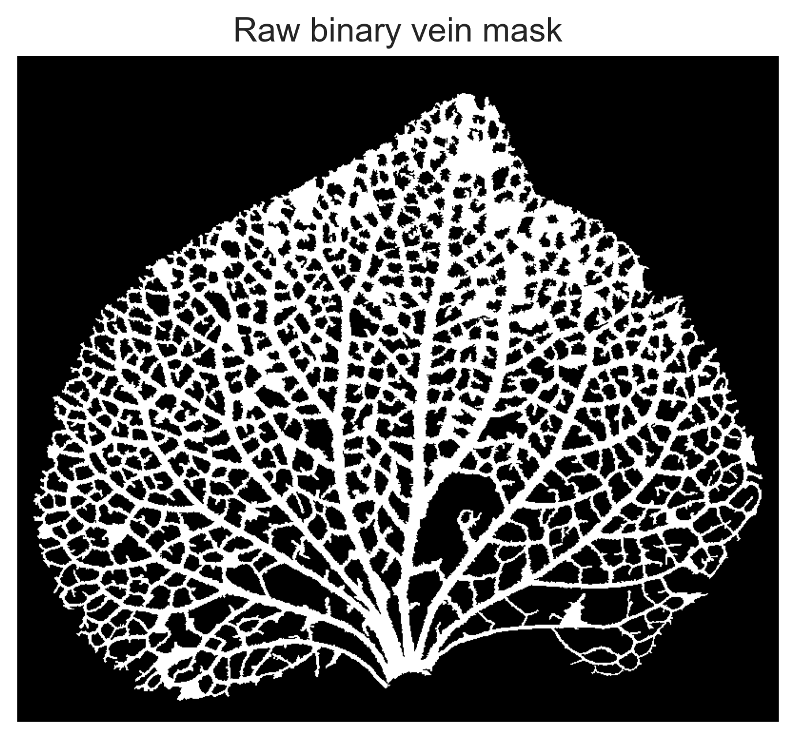
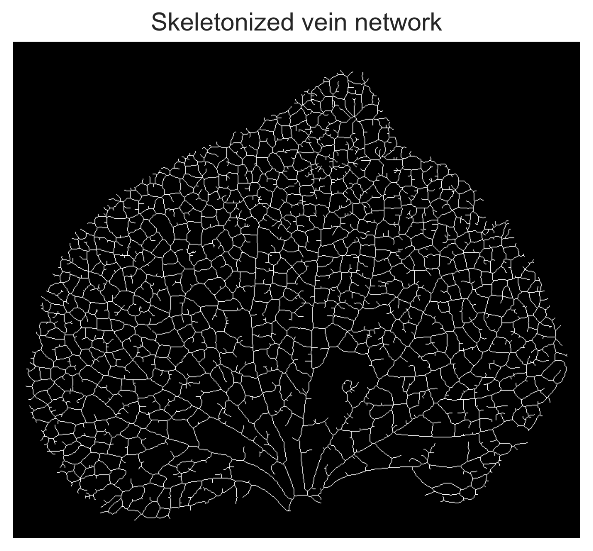
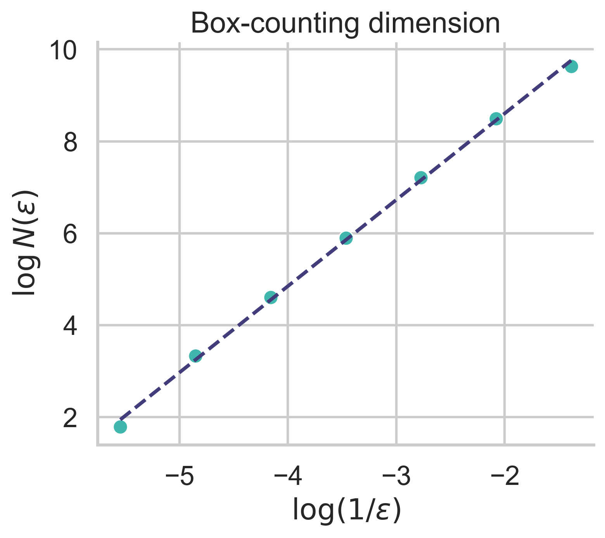
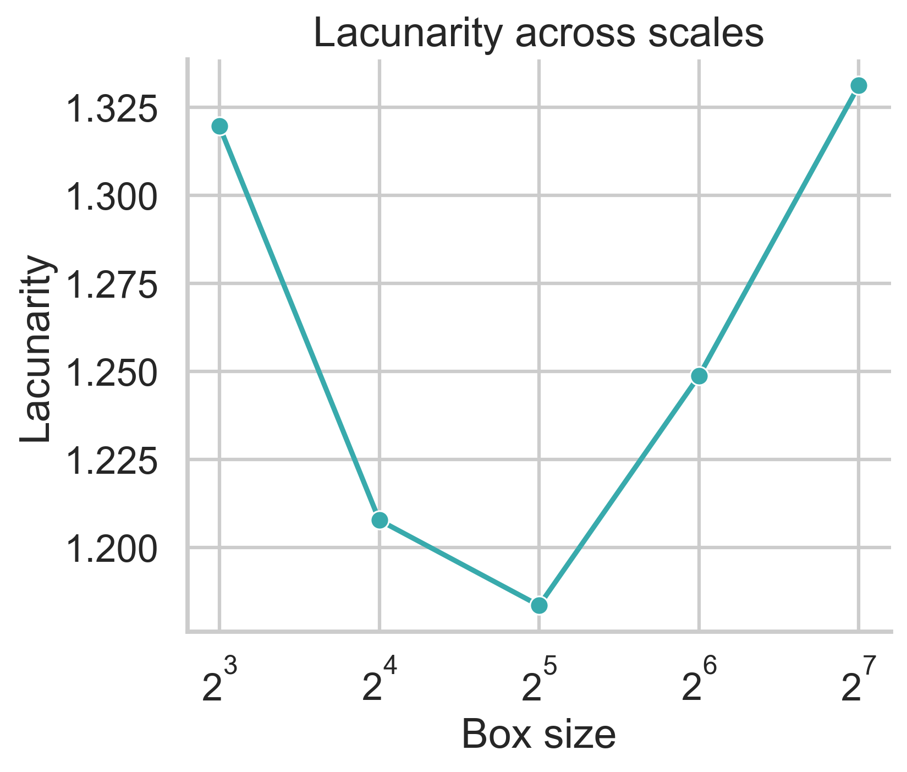
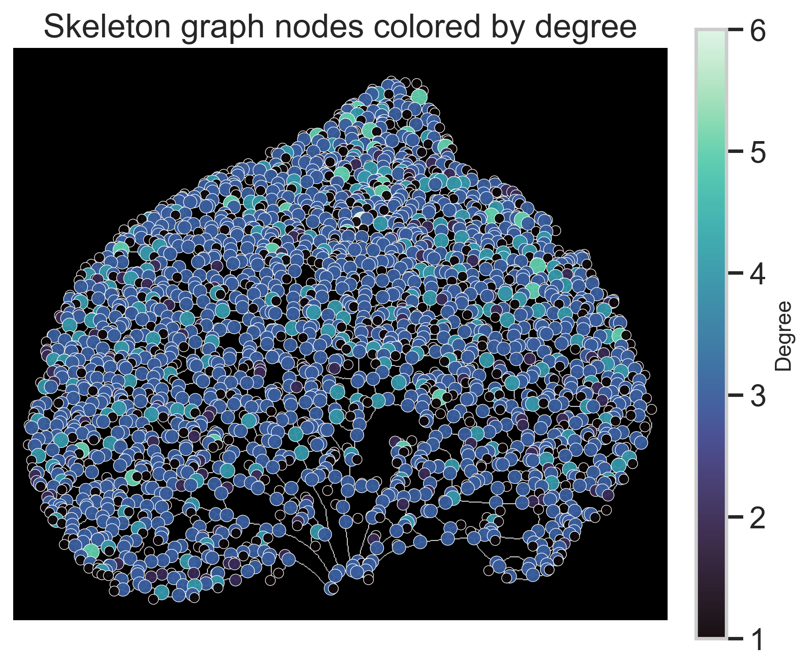
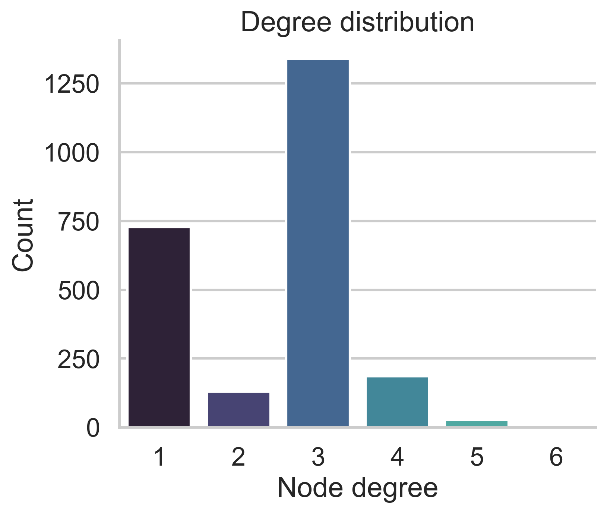
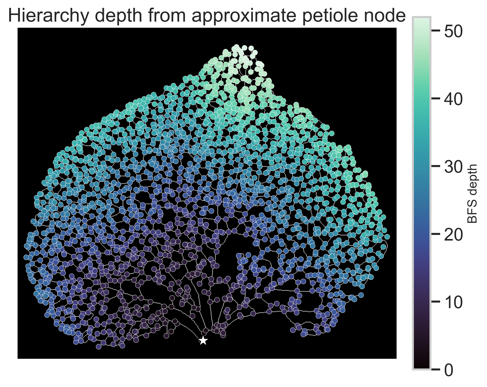
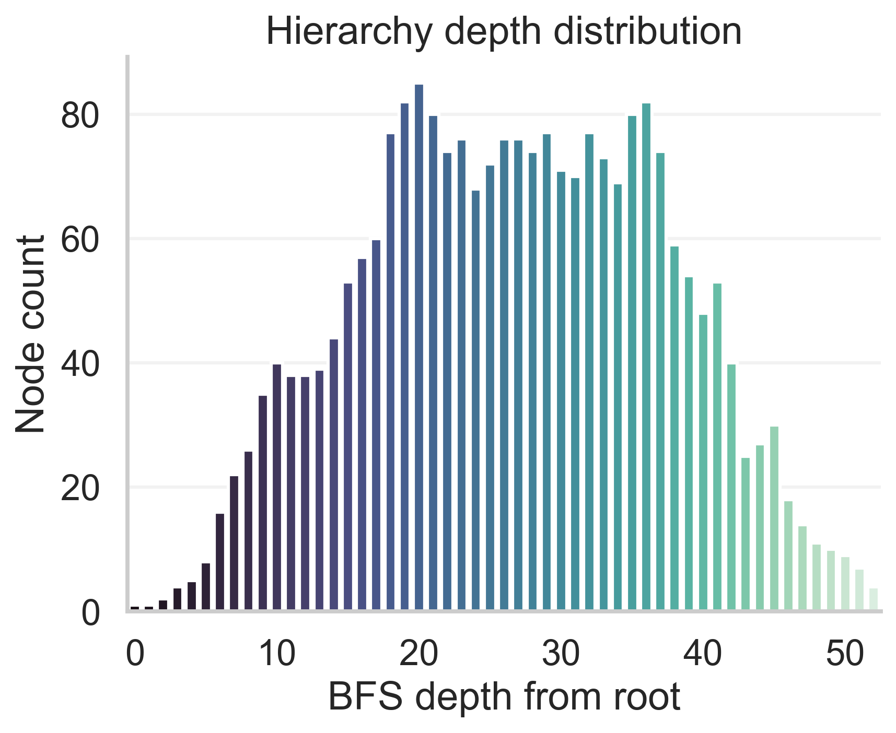

# Plant Fractal

This repository provides a demo pipeline for quantifying fractal-like and network-like structures in plant venation images.

The example script `vein_demo.py` processes a leaf venation image, extracts the binary vein mask and skeleton, estimates fractal and lacunarity metrics, reconstructs the skeleton network, and visualizes graph-theoretic properties such as degree distribution and hierarchy depth.

---

## Repository structure

```text
Plant_fractal/
├── vein_demo.py
├── vein_demo/
│   ├── vein.png
│   ├── 00_original.png
│   ├── 01_raw_binary_mask.png
│   ├── 02_skeleton.png
│   ├── 03_porosity_hull.png
│   ├── 04_box_counting_dimension.png
│   ├── 05_lacunarity_curve.png
│   ├── 06_network_nodes_by_degree.png
│   ├── 07_degree_distribution.png
│   ├── 08_hierarchy_depth.png
│   ├── 09_hierarchy_depth_distribution.png
│   ├── summary_metrics.csv
│   ├── node_metrics.csv
│   ├── edge_metrics.csv
│   ├── box_counting_data.csv
│   ├── lacunarity_data.csv
│   └── degree_distribution.csv
└── README.md
```

---


## Usage

Run the demo script from the project root:

```bash
python vein_demo.py
```

The script reads the input image:

```text
vein_demo/vein.png
```

and saves all output figures and tables into:

```text
vein_demo/
```

---

## Image processing workflow

The raw venation image is converted into a binary vein mask and then skeletonized into a one-pixel-wide network representation. This workflow preserves the major topological structure of the venation network while simplifying the structure for graph analysis.

<p align="center">
  
  
  
</p>

---

## Fractal and lacunarity analysis

The box-counting dimension estimates the spatial filling complexity of the venation network across scales. Lacunarity measures the heterogeneity of the pore or gap distribution across different window sizes.

<p align="center">
  
  
</p>

---

## Network topology analysis

After skeletonization, the vein network is represented as a graph composed of nodes and edges. Nodes are colored by graph degree to show local branching complexity. The degree distribution summarizes the abundance of endpoints, simple branch points, and higher-order junctions.

<p align="center">
  
  
</p>

---

## Hierarchical organization

The hierarchy depth is estimated by breadth-first search from an approximate basal or petiole node. This provides a simple topological measure of how the network expands from the primary vein toward higher-order peripheral branches.

<p align="center">
  
  
</p>


---

## Main methods

The current demo includes:

- CLAHE contrast enhancement
- Otsu thresholding
- Skeletonization
- Box-counting fractal dimension
- Lacunarity analysis
- Skeleton-to-graph reconstruction
- Degree distribution
- Connected component analysis
- Cycle rank / loop number
- BFS-based hierarchy depth

---


## Citation notes


- Otsu, N. (1979). A threshold selection method from gray-level histograms.
- Zhang, T. Y., & Suen, C. Y. (1984). A fast parallel algorithm for thinning digital patterns.
- Falconer, K. J. (2003). *Fractal geometry: Mathematical foundations and applications*.
- Plotnick, R. E., Gardner, R. H., Hargrove, W. W., Prestegaard, K., & Perlmutter, M. (1996). Lacunarity analysis.
- Hagberg, A. A., Schult, D. A., & Swart, P. J. (2008). Exploring network structure, dynamics, and function using NetworkX.